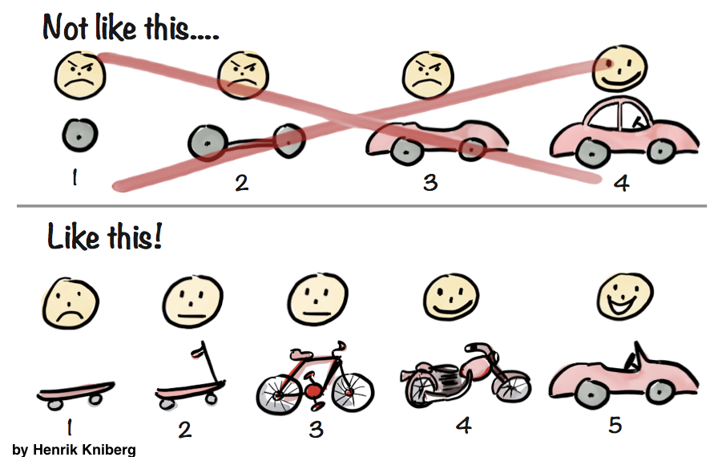

<!-- _class: lead -->
# AIラジオ中間発表

---

# AIラジオとは

## AIを活用したインターネットラジオ

---

# 目的

- 団地と商店街の情報を届ける => ニュース
- 団地住人の声と声をつなげる => お便り

---

# ニュース | 初期バージョン

1~3を1日に3回バッチ処理で行う

1. 地域ニュースRRSからデータ取得
2. RSSデータからラジオスクリプト生成
3. ラジオスクリプトをTTSで音声データ化
4. TownFM.com で配信

技術スタック: AWS Lambda, LangChain, OpenAI API

---

# ユーザーレビューの実施

<section class="flex-slide">
  

    
    

    不定期に継続中   
    - 団地関係者、商店街関係者の集まり  
    - 商店街でのイベント  
    - 地域活性化グループとZoom  
    

  

</section>

---

# 課題

- TTSの読み間違いが多い
- 著作権の問題で音楽の配信がない
- 地域ニュースは地味なものが多く面白くない
- 話しを膨らませようとしても面白くならない
- 自動で次々ニュースが公開されていたが聞かれていない
- ドメイン名を伝えても、ブラウザを開いてアクセス困難

---

# 改善1: ニュース配信

- 団地と商店街の情報を人づてに集める
- 集めたニュースを手動でLLMを使いnote記事にする
- note記事を地域活性化メンバーに読んでもらう
- 問題なければTTSで音声データを生成
- 読み間違いがあれば調整して再度生成 => [記事](https://note.com/townfm/n/ncfbb19647034)見ながら[デモ](https://townfm.com/)

---

# 改善2: 音楽配信

- [note記事](https://note.com/townfm/n/ncfbb19647034)を元に歌詞を生成
- [歌詞](https://note.com/townfm/n/ncfbb19647034#f2974846-3feb-4ac1-ac17-a9b7ab9968c8)に合わせて曲のスタイルを決める
- sunoで音楽生成し配信 => [歌詞](https://note.com/townfm/n/ncfbb19647034#f2974846-3feb-4ac1-ac17-a9b7ab9968c8)を見ながら[デモ](https://townfm.com/)

---

# 改善3: ラジオへの導線

- [公式LINE](https://lin.ee/vsGZl6W)から聴けるようにする => [デモ](https://lin.ee/vsGZl6W)
- ドメイン名ではなく、友達追加QRコードを共有する
- おすすめの記事が公開されたらLINEから配信

---

# お便り

- 現在: Difyでフローを組んで自動でコンテンツとして配信  
- 課題: 短かったり、あまり面白くないお便り
- 今後: 自動で配信は停止し、どのような読み上げ内容だとユーザーの反応がよいか検証する

---

# APIについて

- 現在: S3のバケットをリストにして返却
- 課題: ニュースのタイトル、文書なども欲しい
- 対応: スプレッドシートとGASで簡易的なAPIを生成

---

# フロントエンド

- 現在  
  - index.htmlのみでAPIからのレスポンス通り表示
- 課題  
  - 再生済みのコンテンツが毎回再生される。
  - 特定ニュースの共有が出来ない
- 今後  
  - ブラウザのローカルストレージとルーティングを活用

---

# 教訓

<section class="flex-slide">
  

    
    

      時間をかけて開発しても 
      全く使われない可能性もある。 
      まずはMVPを見極め 
      ユーザー検証を行うことが重要
    

  

</section>

